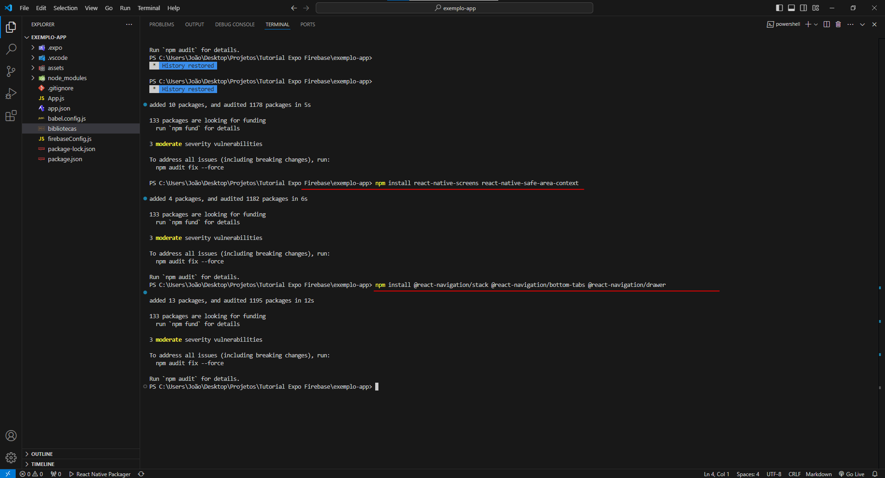

# Configuração Local do Expo

Este guia orienta você na configuração do Expo no seu computador, permitindo desenvolver aplicativos React Native localmente, sem depender de plataformas online como o **Snack.Expo**. Este guia foi criado para simplificar a experiência de início de projetos mobile usando React Native com Expo, evitando algumas das dificuldades comuns para iniciantes.

## Requisitos

- **Node.js**: Versão 20 ou superior. [Baixe aqui](https://nodejs.org/)
- **Editor de código**: Escolha o editor que preferir (recomendamos o [VSCode](https://code.visualstudio.com/))

## Passo a Passo da Configuração

### Passo 1: Preparando o Editor de Código

Abra o editor de código no diretório onde deseja criar seu projeto. Neste guia, utilizamos o VSCode, mas qualquer editor é compatível.


### Passo 2: Iniciando um Novo Projeto Expo

No terminal do seu editor de código, execute o comando:

```bash
npx create-expo-app . --template
```

Este comando irá buscar os templates do Expo.


### Passo 3: Selecionando o Template

Quando solicitado no terminal, escolha a opção:

```bash
> Blank - a minimal app as clean as an empty canvas
```

Essa escolha cria um projeto básico.


### Passo 4: Instalando o Projeto

Aguarde enquanto o Expo cria e configura seu projeto automaticamente.


### Passo 5: Verificando a Criação do Projeto

Após a instalação, verifique que novos arquivos foram gerados no seu diretório de projeto. Isso indica que a criação foi bem-sucedida.


### Passo 6: Inicializando o Projeto

Para iniciar o projeto, use:

```bash
npx expo start --web
```

Se aparecer um erro, não se preocupe. Falta instalar uma dependência.


### Passo 7: Instalando Dependências Faltantes

O terminal exibirá um comando para instalar as dependências ausentes. Copie e execute-o:

```bash
npx expo install react-native-web react-dom @expo/metro-runtime
```


### Passo 8: Reiniciando o Projeto

Após instalar as dependências, reinicie o projeto com:

```bash
npx expo start --web
```


### Passo 9: Carregando o Projeto

O projeto agora começará a ser carregado. Aguarde até ver a interface do Expo.


### Passo 10: Explorando no Celular

Um QR code será exibido na tela. Para visualizar o app no celular, escaneie o código com o **Expo Go** (disponível na Play Store), estando na mesma rede que seu celular.


### Passo 11: Confirmação de Sucesso

Se uma mensagem verde aparecer, seu app foi iniciado com sucesso e está disponível no navegador.


### Passo 12: Visualizando no Navegador

Agora, seu app está disponível localmente no navegador. Qualquer alteração será automaticamente refletida ao recarregar a página.


### Passos 13 a 15: Ajuste para Formato Mobile no Navegador

Para uma visualização no formato mobile:

1. Clique com o botão direito no navegador e selecione "Inspecionar elemento".
2. Ative o modo de visualização para dispositivos móveis clicando no ícone específico.
3. Agora, seu app estará visível no formato de um celular.


### Passo 16: Instalando Dependências no Projeto

Para instalar dependências no seu projeto, use:

```bash
npm install <dependência>
```

Se ocorrerem erros de compatibilidade, você pode forçar a instalação ignorando conflitos de versões com o comando:

```bash
npm install <dependência> --legacy-peer-deps
```

Esse método é recomendado apenas se a biblioteca for essencial.



## Conclusão

Parabéns! Agora você configurou o Expo localmente e está pronto para desenvolver aplicativos móveis no seu ambiente. Em caso de dúvidas ou problemas, sinta-se à vontade para abrir uma issue neste repositório ou entre em contato comigo em redes sociais. Boa sorte e bom desenvolvimento!